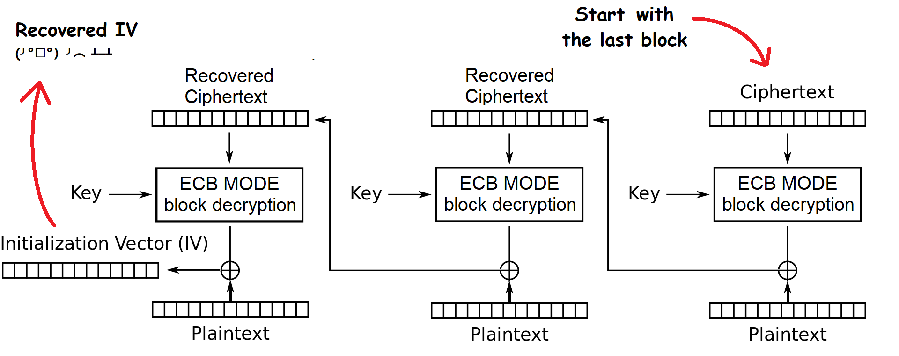

# 435!

Source files and Solve Script: [TMUCTF/435!](https://github.com/r3yc0n1c/CTF-Writeups/tree/main/2021/TMUCTF/435)

### Observations

* We know the partial AES key
* The AES-CBC encrypted partial output data ****is also given
* 3 bytes are missing\(represented by asterisks\(\*\)\) from the key
* The last 21 bytes \(42 hex nibbles\) are intact in the output

### Attack Idea

**STEP 1:** Brute-force the 3 unknown bytes of the key.

**STEP 2:** Use the key to decrypt the last block of the ciphertext with the ECB MODE.

**STEP 3:** XOR the decrypted data with the corresponding plaintext block \(we know the whole plaintext\) to recover the previous block.

**STEP 4:** Change the last block with the current block and repeat **STEP 2-3.** With this method, you can recover the whole ciphertext and that can act as a sanity check to find the correct key.

**STEP 5:** Extract the IV \(the flag\) from the first block of the ciphertext and plaintext using **STEP 2-3** for the last time. 

